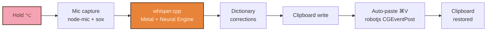
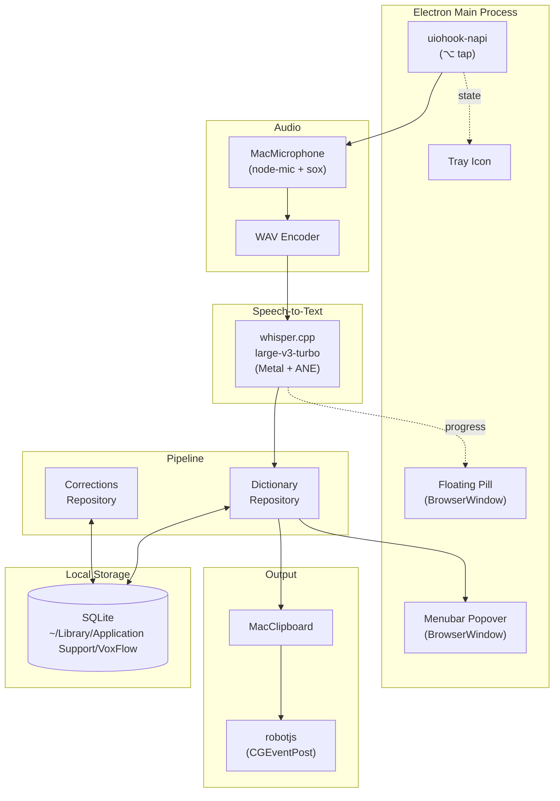

<div align="center">


# VoxFlow

**Hold <kbd>⌥</kbd>. Talk. Let go. Your words at the cursor.**

A private, local-only macOS dictation app. Your voice never leaves your Mac.

[](LICENSE)
[](#requirements)
[](docs/PRIVACY.md)
[](https://github.com/ggml-org/whisper.cpp)

</div>

---

> [!NOTE]
> **The pitch, in one paragraph.**
> Wispr Flow charges $15/month to send your voice to their servers. VoxFlow does the same job — press-and-hold voice dictation with auto-paste — except your audio never leaves your Mac, history lives in a SQLite file you control, and the code is MIT-licensed. On an M4 Pro, a 2–5 second dictation transcribes in ~500 ms. No account, no API key, no subscription.

<div align="center">

**[Quick Start](#quick-start)** &nbsp;·&nbsp; **[How It Works](#how-it-works)** &nbsp;·&nbsp; **[Why Not Wispr?](#why-voxflow-over-wispr-flow)** &nbsp;·&nbsp; **[Privacy](#privacy-by-design)** &nbsp;·&nbsp; **[Roadmap](#roadmap)**

</div>

---

## Quick Start

> [!TIP]
> You don't need an API key, an account, or a credit card. Only two things: Node 18+ and `sox`.

```bash
git clone https://github.com/gregdbanks/voxflow.git
cd voxflow
brew install sox
npm install
npm start
```

On first launch VoxFlow downloads the Whisper model (~1.5 GB) from Hugging Face — shown with a progress bar in the popover. After that, it never phones home again.

<details>
<summary><strong>macOS will ask for two permissions the first time — here's what and why</strong></summary>

<br/>

| Permission | Why | Where |
|---|---|---|
| **Microphone** | So VoxFlow can hear you | Prompts automatically — click Allow |
| **Accessibility** | So VoxFlow can detect the hold-⌥ hotkey and post `⌘V` at the cursor | Prompts on first dictation, or add manually: System Settings → Privacy & Security → Accessibility → `+` → `/Applications/VoxFlow.app` |

> [!WARNING]
> **Unsigned build caveat.** Because VoxFlow is built without an Apple Developer ID, every rebuild changes the code signature hash. macOS TCC pins Accessibility grants to that hash, so after a rebuild you may need to remove and re-add the VoxFlow row. [More on why](#apple-developer-limitations).

</details>

---

## How It Works

The full pipeline, end-to-end, runs in your Mac's memory:



From your perspective it's one gesture: hold Option, talk, let go. The red pill at the bottom of your screen shows a live waveform while you're recording, vanishes when you release, and your words appear at the cursor about a second later.

**What's happening underneath:**
- `uiohook-napi` installs a `CGEventTap` to detect the bare Option key.
- `node-mic` spawns `sox` to capture 16 kHz PCM audio.
- `smart-whisper` runs OpenAI Whisper (`large-v3-turbo`) in-process with Metal shader acceleration and Neural Engine offload.
- Your personal dictionary rewrites proper nouns ("Kaden" → "Kayden").
- `robotjs` posts `⌘V` via `CGEventPost` — in-process, so it inherits VoxFlow's Accessibility grant.
- The pre-dictation clipboard contents are restored 150 ms later.

<details>
<summary><strong>Full architecture diagram — click to expand</strong></summary>

<br/>



</details>

---

## Features

<table>
<tr>
<td width="33%" valign="top">
<p align="center">
<svg xmlns="http://www.w3.org/2000/svg" width="28" height="28" viewBox="0 0 24 24" fill="none" stroke="#5B3A29" stroke-width="2" stroke-linecap="round" stroke-linejoin="round"><rect x="3" y="11" width="18" height="11" rx="2"/><path d="M7 11V7a5 5 0 0 1 10 0v4"/></svg>
</p>

#### Fully local
Your audio is captured, transcribed, and discarded — all on your Mac. No cloud provider. No API key. No account.

</td>
<td width="33%" valign="top">
<p align="center">
<svg xmlns="http://www.w3.org/2000/svg" width="28" height="28" viewBox="0 0 24 24" fill="none" stroke="#5B3A29" stroke-width="2" stroke-linecap="round" stroke-linejoin="round"><path d="M13 2 3 14h9l-1 8 10-12h-9l1-8Z"/></svg>
</p>

#### Instant
Metal + Apple Neural Engine acceleration. Typical 2–5 s dictation transcribes in **500 ms–2 s**. No network round-trip.

</td>
<td width="33%" valign="top">
<p align="center">
<svg xmlns="http://www.w3.org/2000/svg" width="28" height="28" viewBox="0 0 24 24" fill="none" stroke="#5B3A29" stroke-width="2" stroke-linecap="round" stroke-linejoin="round"><path d="M12 2a3 3 0 0 0-3 3v7a3 3 0 0 0 6 0V5a3 3 0 0 0-3-3Z"/><path d="M19 10v2a7 7 0 0 1-14 0v-2"/><line x1="12" x2="12" y1="19" y2="22"/></svg>
</p>

#### Press-and-hold
Bare `⌥` key trigger via an in-process `CGEventTap`. No modifier gymnastics. Release = transcription.

</td>
</tr>
<tr>
<td valign="top">
<p align="center">
<svg xmlns="http://www.w3.org/2000/svg" width="28" height="28" viewBox="0 0 24 24" fill="none" stroke="#5B3A29" stroke-width="2" stroke-linecap="round" stroke-linejoin="round"><rect x="8" y="2" width="8" height="4" rx="1" ry="1"/><path d="M16 4h2a2 2 0 0 1 2 2v14a2 2 0 0 1-2 2H6a2 2 0 0 1-2-2V6a2 2 0 0 1 2-2h2"/></svg>
</p>

#### Clipboard-safe
Your clipboard is saved before dictation and restored after paste. You never lose what you had copied.

</td>
<td valign="top">
<p align="center">
<svg xmlns="http://www.w3.org/2000/svg" width="28" height="28" viewBox="0 0 24 24" fill="none" stroke="#5B3A29" stroke-width="2" stroke-linecap="round" stroke-linejoin="round"><path d="M3 12a9 9 0 1 0 9-9 9.75 9.75 0 0 0-6.74 2.74L3 8"/><path d="M3 3v5h5"/><path d="M12 7v5l4 2"/></svg>
</p>

#### Searchable history
Your last 1,000 transcriptions, stored locally in SQLite. Filter by text, Copy, or Paste-again.

</td>
<td valign="top">
<p align="center">
<svg xmlns="http://www.w3.org/2000/svg" width="28" height="28" viewBox="0 0 24 24" fill="none" stroke="#5B3A29" stroke-width="2" stroke-linecap="round" stroke-linejoin="round"><path d="M4 19.5v-15A2.5 2.5 0 0 1 6.5 2H20v20H6.5a2.5 2.5 0 0 1 0-5H20"/></svg>
</p>

#### Personal dictionary
Teach VoxFlow your names and jargon. `Kaden` → `Kayden`, once, permanent.

</td>
</tr>
<tr>
<td valign="top">
<p align="center">
<svg xmlns="http://www.w3.org/2000/svg" width="28" height="28" viewBox="0 0 24 24" fill="none" stroke="#5B3A29" stroke-width="2" stroke-linecap="round" stroke-linejoin="round"><path d="M2 12h3"/><path d="M7 6v12"/><path d="M11 3v18"/><path d="M15 8v8"/><path d="M19 5v14"/><path d="M22 12h-3"/></svg>
</p>

#### Live waveform
A floating pill at the bottom of the screen pulses with your voice. Only visible while you're recording.

</td>
<td valign="top">
<p align="center">
<svg xmlns="http://www.w3.org/2000/svg" width="28" height="28" viewBox="0 0 24 24" fill="none" stroke="#5B3A29" stroke-width="2" stroke-linecap="round" stroke-linejoin="round"><path d="M12 22s8-4 8-10V5l-8-3-8 3v7c0 6 8 10 8 10Z"/><path d="m9 12 2 2 4-4"/></svg>
</p>

#### Persistent privacy badge
The popover always displays a green badge confirming audio is local. There's no cloud state because there's no cloud path.

</td>
<td valign="top">
<p align="center">
<svg xmlns="http://www.w3.org/2000/svg" width="28" height="28" viewBox="0 0 24 24" fill="none" stroke="#5B3A29" stroke-width="2" stroke-linecap="round" stroke-linejoin="round"><path d="M22 3H2l8 9.46V19l4 2v-8.54L22 3z"/></svg>
</p>

#### Repetition scrubber
Whisper's classic `"word word word"` stutter is collapsed automatically. Two-word repetitions ("yes yes") are left alone.

</td>
</tr>
</table>

---

## Why VoxFlow over Wispr Flow?

<table>
<tr>
<th width="20%"></th>
<th width="40%" align="center">

**VoxFlow**

</th>
<th width="40%" align="center">

**Wispr Flow**

</th>
</tr>
<tr>
<td align="right"><strong>Price</strong></td>
<td align="center">Free forever</td>
<td align="center">$15 / month</td>
</tr>
<tr>
<td align="right"><strong>Audio leaves your Mac?</strong></td>
<td align="center">Never</td>
<td align="center">Every dictation</td>
</tr>
<tr>
<td align="right"><strong>Works offline?</strong></td>
<td align="center">Yes (after model download)</td>
<td align="center">No, requires internet</td>
</tr>
<tr>
<td align="right"><strong>Your clipboard preserved?</strong></td>
<td align="center">Saved + restored</td>
<td align="center">Varies</td>
</tr>
<tr>
<td align="right"><strong>Transcription history location</strong></td>
<td align="center">Local SQLite you own</td>
<td align="center">Their cloud</td>
</tr>
<tr>
<td align="right"><strong>Source code</strong></td>
<td align="center">Open (MIT)</td>
<td align="center">Closed</td>
</tr>
<tr>
<td align="right"><strong>Customizable hotkey</strong></td>
<td align="center">Any Electron accelerator</td>
<td align="center">Fixed options</td>
</tr>
<tr>
<td align="right"><strong>Lock-in</strong></td>
<td align="center">None</td>
<td align="center">Subscription</td>
</tr>
</table>

<br/>

> [!IMPORTANT]
> VoxFlow is not trying to be a drop-in Wispr replacement for everyone. If you want a polished commercial product backed by a company with a support team, pay for Wispr. If you want to own your dictation stack end-to-end, don't want to send your voice to anyone, and you're OK with a personal-scale Mac app, read on.

---

## Privacy by Design

VoxFlow has exactly **one** network touch in its entire lifetime: a single HTTP GET for the Whisper model file (~1.5 GB) from Hugging Face, the first time you launch. After that, it never makes another network call.

**Verify it yourself** while dictating:

```bash
sudo lsof -i -n -P -c VoxFlow
```

You'll see zero outbound connections. For a stricter test, disconnect from the internet and keep dictating — everything works identically.

Full data-flow inventory: **[docs/PRIVACY.md](docs/PRIVACY.md)**

---

## Take VoxFlow to Another Mac

<details>
<summary><strong>Option A — Clone and build (recommended for a second dev machine)</strong></summary>

<br/>

Requirements: Apple Silicon Mac, Node 18+, Xcode Command Line Tools, Homebrew.

```bash
xcode-select --install            # if not already installed
git clone https://github.com/gregdbanks/voxflow.git
cd voxflow
brew install sox
npm install
npm start                          # dev mode — auto-rebuilds natives
```

For a packaged install:

```bash
npm run package
cp -R out/VoxFlow-darwin-arm64/VoxFlow.app /Applications/
open /Applications/VoxFlow.app
```

</details>

<details>
<summary><strong>Option B — Copy the packaged <code>.app</code> to another Mac</strong></summary>

<br/>

Faster; skips the toolchain setup. Caveats:

- Only works on the same CPU architecture (arm64 → arm64).
- macOS will show "unidentified developer" warnings — right-click → Open → Open to allow.
- Mic + Accessibility grants don't travel. Grant them on each Mac.
- The Whisper model lives per-machine in `~/Library/Application Support/VoxFlow/models/`. First launch on the new Mac downloads it again.

```bash
tar -czf voxflow.tgz -C out/VoxFlow-darwin-arm64 VoxFlow.app
# transfer voxflow.tgz → unpack on the other Mac:
tar -xzf voxflow.tgz -C /Applications/
```

</details>

<details>
<summary><strong>What's NOT portable (yet)</strong></summary>

<br/>

- **Syncing history/dictionary across Macs.** The SQLite file is local. Copy `~/Library/Application Support/VoxFlow/voxflow.sqlite` manually if you want to mirror state.
- **One-click install for non-developer friends.** You'd need a notarized, signed build ($99/yr Apple Developer Program). The current build works, but Gatekeeper warnings apply.

</details>

---

## Tech Stack

| Layer | Library | Role |
|---|---|---|
| Shell | [Electron](https://www.electronjs.org/) 33 | Menubar app foundation |
| Hotkey | [`uiohook-napi`](https://github.com/SnosMe/uiohook-napi) | In-process `CGEventTap` for bare-⌥ detection |
| Auto-paste | [`robotjs`](https://robotjs.io/) | In-process `CGEventPost` for `⌘V` |
| Microphone | [`node-mic`](https://github.com/eshaz/node-mic) + Homebrew `sox` | PCM capture |
| Transcription | [`whisper.cpp`](https://github.com/ggml-org/whisper.cpp) via [`smart-whisper`](https://github.com/JacobLinCool/smart-whisper) | On-device Whisper with Metal + ANE |
| Storage | [`better-sqlite3`](https://github.com/WiseLibs/better-sqlite3) | Local, synchronous, zero-deps |
| UI | Vanilla HTML + [Vite](https://vite.dev/) | Lightweight for a 400-px popover |
| Tests | [Vitest](https://vitest.dev/) + [Playwright](https://playwright.dev/) | Unit + e2e |

All production dependencies MIT / Apache-2.0 / ISC. Run `npx license-checker --production --summary` to verify.

---

## Development

```bash
npm start              # dev mode (auto-rebuilds native deps for Electron)
npm test               # 69 unit tests, ~400ms
npm run test:e2e       # Playwright launches packaged Electron
npm run typecheck      # tsc --noEmit, strict
npm run lint           # ESLint
npm run package        # → out/VoxFlow-darwin-arm64/VoxFlow.app
npm run build:icon     # rebuild assets/icon.icns from assets/logo.svg
```

See [CONTRIBUTING.md](CONTRIBUTING.md) for deeper notes on the native module rebuild flow and the macOS re-grant ritual.

---

## Apple Developer Limitations

Everything works on an unsigned build. The only paper cut is re-granting Accessibility after rebuilds, because macOS TCC pins permission grants to the code directory hash (cdhash) and rebuilding an unsigned binary changes the hash.

> [!NOTE]
> **What a paid Apple Developer ID ($99/yr) would unlock:**
> 1. **Sticky grants.** Sign with a Developer ID cert — macOS tracks grants by cert identity, not cdhash. Rebuild all you want.
> 2. **Gatekeeper-clean distribution.** Friends installing the `.app` wouldn't see "unidentified developer" warnings.
> 3. **Helper-subprocess TCC.** The old `paste-helper` / `key-listener` architecture (preserved in `native/` for reference) would work, letting you factor keyboard logic out of the Electron main process.

For a personal build, none of this is required. `robotjs` and `uiohook-napi` run inside the main Electron process which holds its Accessibility grant across reasonable use.

---

## Roadmap

- First-launch onboarding window with permission walkthrough.
- Launch-at-login toggle (LoginItems registration).
- Fuzzy dictionary correction ("teh" → "the" without a rule).
- Auto-learn dictionary entries from post-paste edits.
- Offline model picker in settings (swap between `small.en`, `large-v3-turbo`, etc.).
- History pagination + time filters beyond 1,000 entries.
- Snippets: `/email` expands to a template.
- Windows + Linux ports (platform ports are already abstracted).

---

## License

MIT — use it, modify it, redistribute it. See [LICENSE](LICENSE).

## Credits

- Speech-to-text by OpenAI's [Whisper](https://openai.com/research/whisper) (MIT-licensed weights) running on-device via [whisper.cpp](https://github.com/ggml-org/whisper.cpp).
- Pixel logo hand-drawn in SVG.
- Inspired by — and a free, local-first alternative to — [Wispr Flow](https://wisprflow.ai). Not affiliated with or endorsed by Wispr.

<div align="center">

<br/>

<sub>Built on macOS. No cloud. No subscription. No surprises.</sub>

</div>
