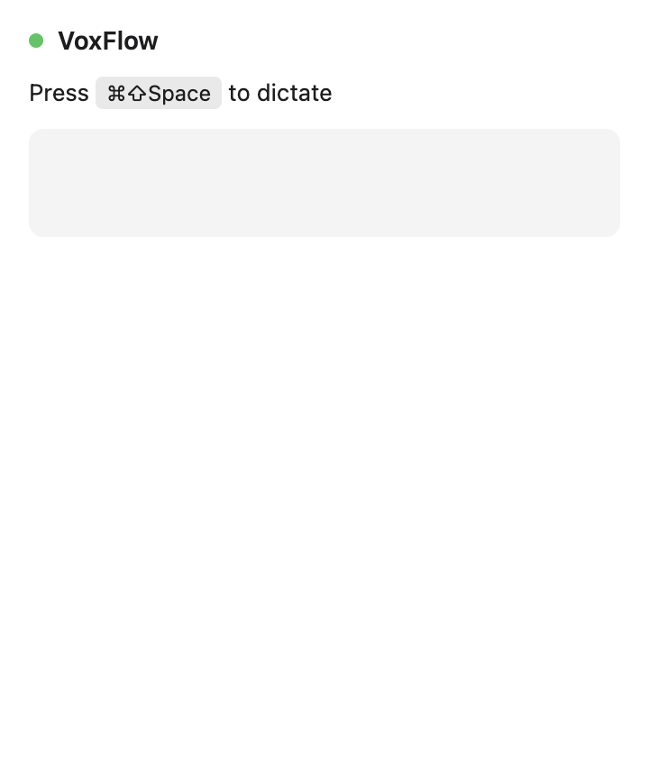

# M1 — Project Scaffolding + Menubar Shell

Source: [#1 M1: Project Scaffolding + Menubar Shell](https://github.com/gregdbanks/voxflow/issues/1)

## Automated screenshots

### `02-dropdown-window-idle.png`

**How to reproduce:** `npx electron-forge package && npx tsx scripts/capture-m1-screenshots.ts`.

**What to verify:**
- Header reads **VoxFlow**.
- Status line reads `Press ⌘⇧Space to dictate`.
- Leading dot is **green** — the `idle` state.
- Transcription area below is an empty rounded box (no text yet).
- No window chrome / traffic-light buttons — it's a borderless menubar popover.

This proves the done-when item **"Clicking tray opens dropdown window"**: the
Playwright harness launches Electron and pulls the same preloaded window the
tray click would reveal.

## Manual screenshots

The macOS menu-bar tray icon and the right-click context menu cannot be captured
reliably from a background script (the menu bar is hidden when a fullscreen app
is in focus, and synthesizing a right-click on the tray icon requires
Accessibility permission that the user must grant by hand). Follow these steps
to verify manually and drop the resulting `.png` files in this directory
alongside the automated ones.

### `01-tray-icon-in-menubar.png` (manual)

1. Run `npm start`.
2. Wait ~2 seconds for the tray icon to appear in the macOS menu bar. It's a
   small microphone glyph rendered as a template image (adapts to light / dark
   menu bars).
3. Press **Cmd+Shift+3** to screencap the whole screen, or **Cmd+Shift+4**
   followed by **Space** and click the menu bar to capture just that strip.
4. Save as `screenshots/m1/01-tray-icon-in-menubar.png`.

**What to verify:** The tray icon is visible on the right-hand side of the menu
bar and there is **no Dock icon** (the app runs in menu-bar-only mode).

### `03-tray-right-click-quit-menu.png` (manual)

1. With the app running, **right-click** (or Control-click) the VoxFlow tray
   icon.
2. The context menu should show: `VoxFlow` (disabled header), a separator, and
   `Quit`.
3. Use **Cmd+Shift+4** to capture just the menu, then save as
   `screenshots/m1/03-tray-right-click-quit-menu.png`.

**What to verify:** `Quit` is clickable and quits the app when selected.

## Done-when coverage

| Criterion | Evidence |
|---|---|
| `npm start` shows tray icon in macOS menu bar (no Dock icon) | manual `01-tray-icon-in-menubar.png` |
| Clicking tray opens dropdown window | automated `02-dropdown-window-idle.png` |
| Right-click shows context menu with Quit | manual `03-tray-right-click-quit-menu.png` |
| `npm test` passes, `npm run lint` clean, TypeScript strict zero errors | CI — run `npm test && npm run lint && npm run typecheck` |
