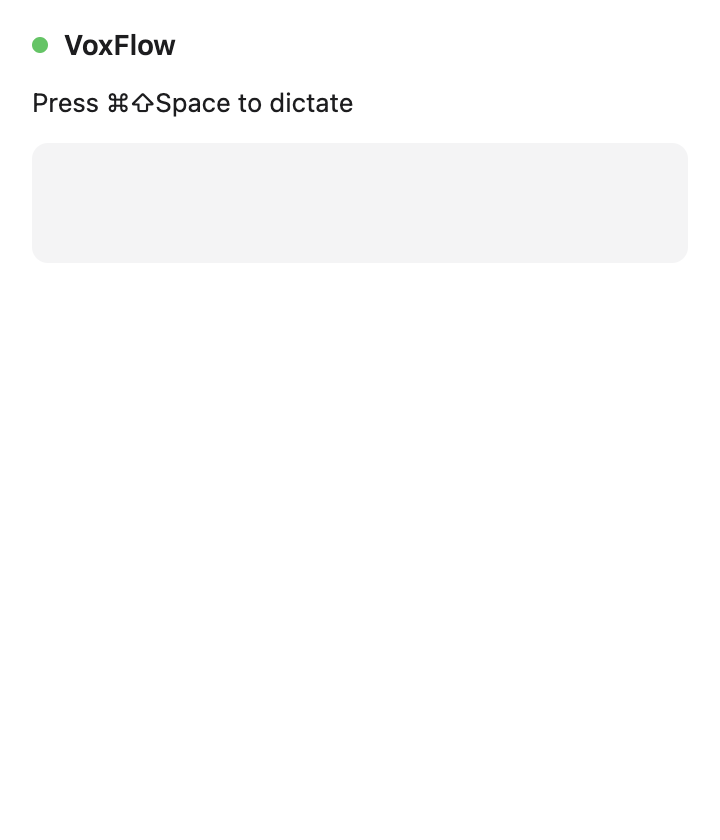
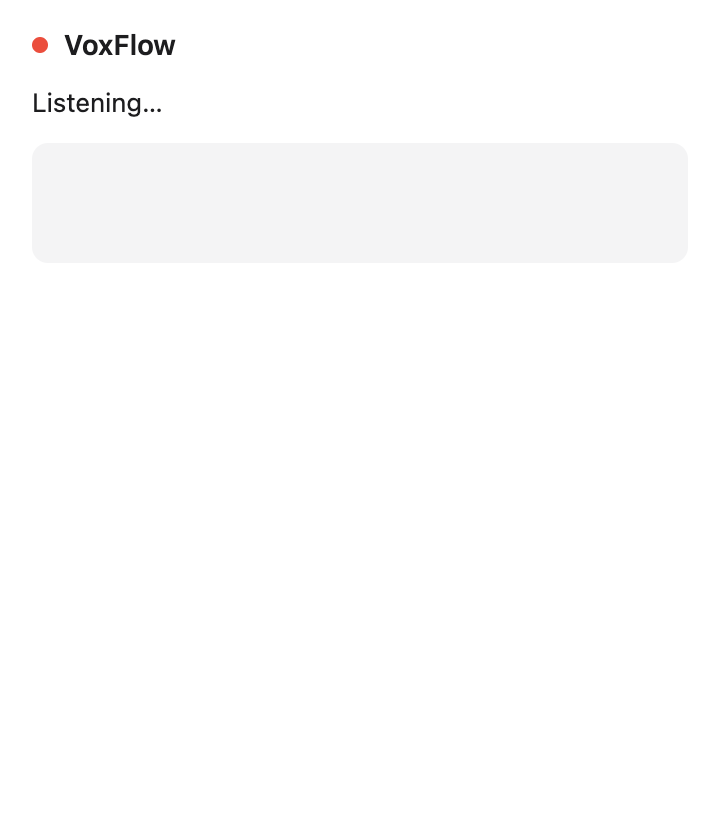
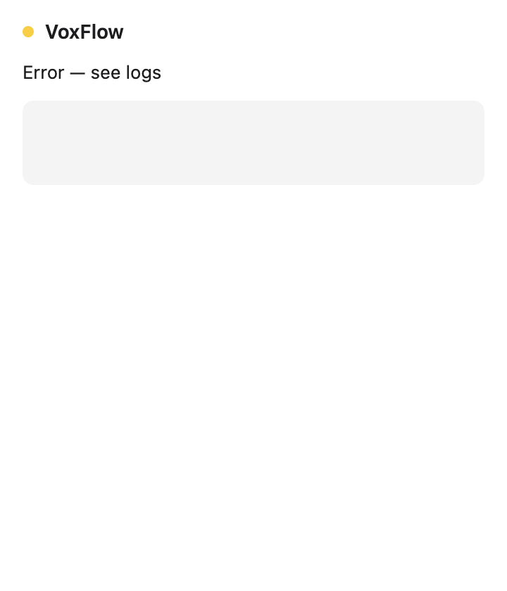

# M2 — Audio Capture Pipeline

Source: [#2 M2: Audio Capture Pipeline](https://github.com/gregdbanks/voxflow/issues/2)

## Automated screenshots

These show the dropdown in each state the audio pipeline can produce. The
M2 wiring is: press hotkey → `AudioRecorder.start()` → `updateState('recording')`
broadcasts through IPC → both the tray tooltip and the dot change. The capture
harness pins each DOM state with transitions disabled so the screenshot pixels
match the real app state (see `scripts/capture-m2-screenshots.ts`).

### `01-idle-waiting-for-hotkey.png` — idle



Green dot. `Press ⌘⇧Space to dictate`. Recorder is not running, tray tooltip
reads `VoxFlow`. This is the resting state after app launch or after a recording
completes successfully.

### `02-recording-active.png` — recording



Red dot (`#ff3b30`). Status changes to `Listening…`. Tray tooltip updates to
`VoxFlow · recording`. Press the hotkey again to stop.

### `03-error-state.png` — error



Amber dot (`#ffcc00`). Status reads `Error — see logs`. Reached if the
microphone can't be started (e.g. sox missing, permission denied) or `stop()`
throws. The main process logs the underlying error via `logger.error`.

## Manual verification

Screenshots prove the UI wiring, but the audio round-trip requires a real mic.
Run once with integration enabled:

```bash
brew install sox  # one-time
VOXFLOW_INTEGRATION=1 npm run test:integration
```

Expected: `MacMicrophone integration › records one second of real audio and
produces a valid WAV` passes. The test asserts the captured WAV has 16 kHz
mono header, non-empty PCM, and duration ≥ 700 ms.

For a full dog-food run:

```bash
npx electron-forge package
npm start
# Press Cmd+Shift+Space — tray tooltip flips to "VoxFlow · recording"
# Press again — console logs: Recording stopped — pcm=<N>B wav=<N>B duration=<ms>
```

## Done-when coverage

| Criterion | Evidence |
|---|---|
| `Cmd+Shift+Space` starts recording, tray icon changes state | `02-recording-active.png` + manual verification |
| Release/press again stops recording | `handleHotkeyToggle` toggles `recorder.isRecording()` in `src/main/index.ts` |
| Console logs WAV buffer size and duration | `logger.info('Recording stopped — pcm=…B wav=…B duration=…ms')` |
| All unit tests pass with stubs | `npm test` — 20 passing incl. `WavEncoder.test.ts`, `AudioRecorder.test.ts`, `hotkey.test.ts` |
