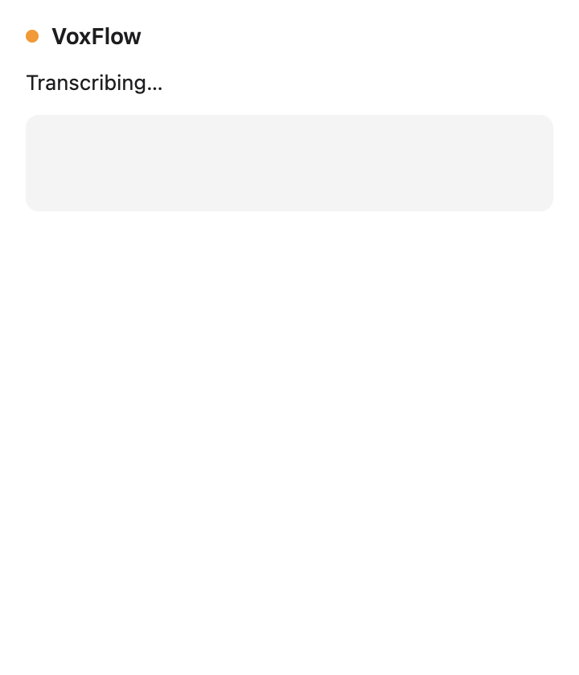
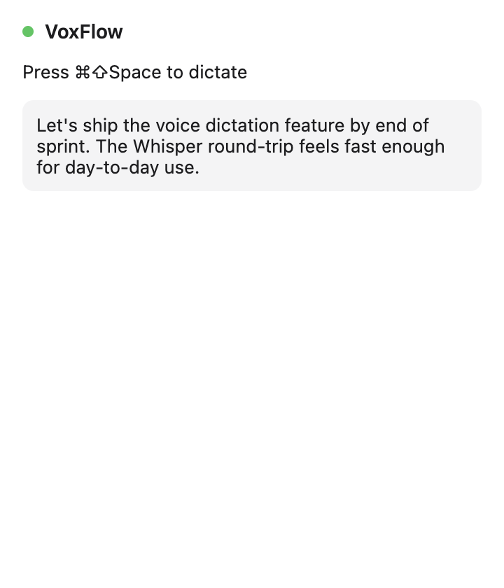
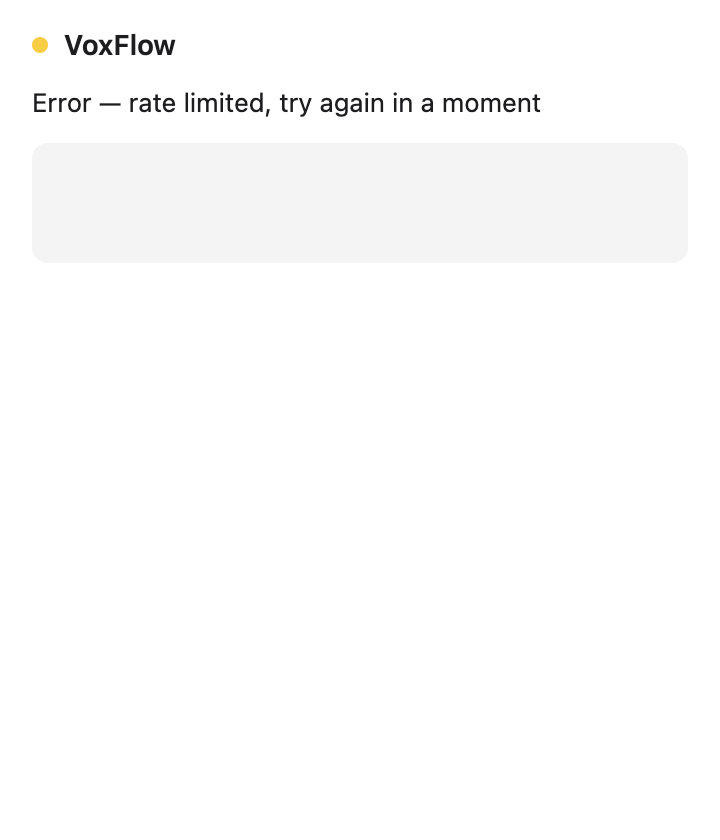

# M3 — Cloud Transcription (Groq Whisper)

Source: [#3 M3: Cloud Transcription](https://github.com/gregdbanks/voxflow/issues/3)

## Pipeline

`DictationPipeline` composes `AudioRecorder` + `ITranscriptionService` and
walks these states:

```
idle → recording → transcribing → idle  (success)
idle → recording → transcribing → error (transcription failure)
idle → recording → error                (mic failure)
```

`GroqTranscriptionService` uses the OpenAI SDK with Groq's OpenAI-compatible
base URL (`https://api.groq.com/openai/v1`). Errors are mapped to a
`TranscriptionError` with a `kind` tag (`auth`, `rate_limited`, `server`,
`network`, `timeout`, `unknown`) so the main process can decide how to surface
them.

## Automated screenshots

### `01-idle-before-dictation.png`


Green dot. Resting state. Press the hotkey to begin.

### `02-recording.png`


Red dot, `Listening…`. The mic is capturing PCM; nothing has been sent yet.

### `03-transcribing.png`



Orange dot, `Transcribing…`. The WAV has been posted to Groq Whisper; we're
waiting on the response. Note the intermediate state — the hotkey is ignored
here to avoid double-send.

### `04-transcription-displayed.png`



Green dot, `Press ⌘⇧Space to dictate`, and the transcribed text shows in the
rounded output box. M4 will take this same text and paste it at the cursor.

### `05-rate-limit-error.png`



Amber dot, `Error — rate limited, try again in a moment`. The pipeline landed
in `error` because the upstream returned 429. Pressing the hotkey again
recovers straight to `recording` — no restart required.

## Done-when coverage

| Criterion | Evidence |
|---|---|
| Record → transcription text displayed in menubar dropdown | `04-transcription-displayed.png` + `DictationPipeline` pushes `voxflow:transcription` IPC in `src/main/index.ts` |
| Error states handled (network failure, rate limit) | `TranscriptionError` + `05-rate-limit-error.png`; `TranscriptionService.test.ts` covers 401/429/5xx/network/timeout |
| MSW mocks cover all API paths | `test/mocks/handlers.ts` + `test/mocks/server.ts`; 6 MSW-backed unit tests |
| No API key in repo | `.env.example` ships empty; `.env` is gitignored; real-API test is gated by `GROQ_API_KEY` |

## Integration test

```bash
export GROQ_API_KEY=gsk_...
npm run test:integration  # uses test/integration/groq-transcription.integration.test.ts
```

The test sends `silence.wav` through the real Groq endpoint and asserts the
response shape — it does not assert any particular text, since silence
transcribes differently across model versions.
