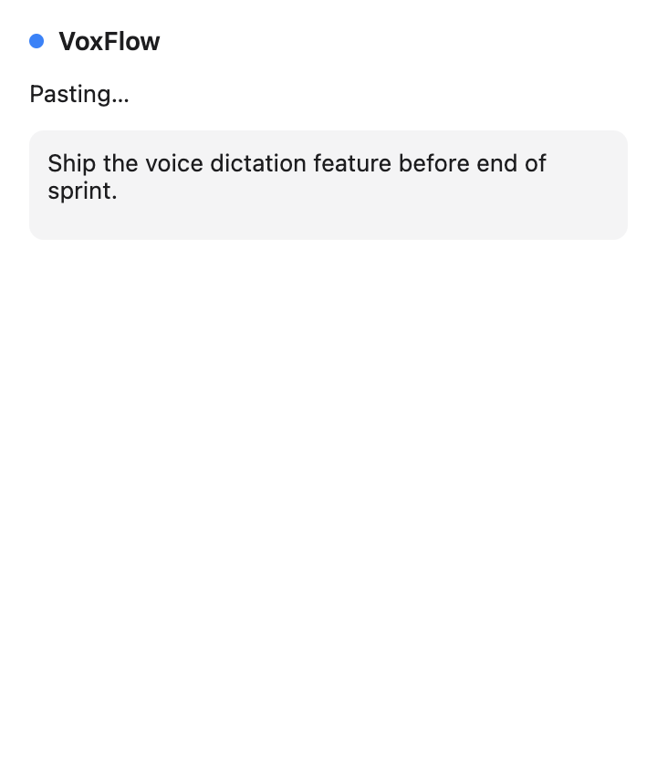
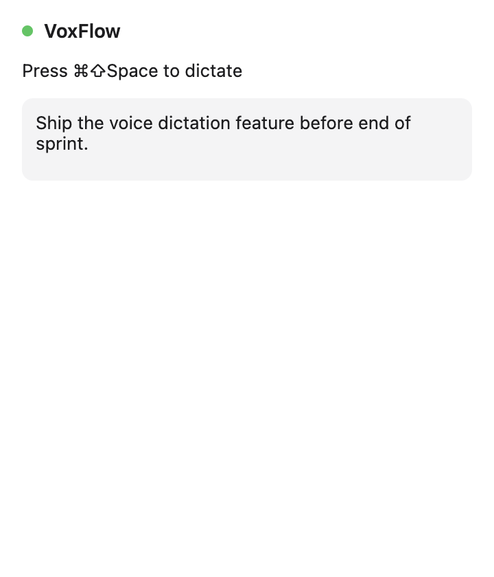
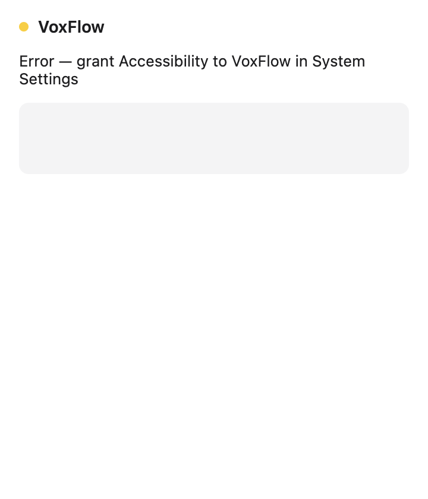

# M4 — Text Injection

Source: [#4 M4: Text Injection](https://github.com/gregdbanks/voxflow/issues/4)

## Full flow

`DictationPipeline` now composes the full trip:

```
idle → recording → transcribing → injecting → idle
```

`TextInjector` owns the three-step injection:

1. Read the current clipboard.
2. Write the transcription text.
3. Send `Cmd+V` via `osascript` (`MacKeystroke`).
4. Restore the original clipboard contents.

`MacActiveWindowDetector` (wrapping `@paymoapp/active-window`) captures the
focused app *before* recording starts — once the hotkey fires and VoxFlow
becomes frontmost, the target app is no longer focused. The detector returns
`null` when Accessibility permission hasn't been granted, and the pipeline
treats that as "unknown app" rather than failing.

## Automated screenshots

### `01-recording.png`


Red dot, `Listening…`. `activeApp` was captured before the mic opened (see
logs for `Transcription injected (... app=TextEdit)`).

### `02-transcribing.png`


Orange dot, `Transcribing…`. Still talking to Groq; no clipboard activity yet.

### `03-injecting-at-cursor.png`



**New in M4** — blue dot (`#0a84ff`), `Pasting…`. The clipboard has been
swapped to the transcription text and `Cmd+V` is about to fire. This is a
brief state (~250 ms) before we restore the original clipboard.

### `04-idle-after-paste.png`



Green dot, back to `Press ⌘⇧Space to dictate`. The dropdown still shows what
was just pasted, so you can confirm at a glance.

### `05-accessibility-permission-error.png`



Amber dot, `Error — grant Accessibility to VoxFlow in System Settings`. Seen
when the `osascript` keystroke call is denied (Accessibility permission missing
for the launching process).

## Manual verification

Automated screenshots prove the UI states. The actual paste at the cursor
needs a real app:

```bash
npx electron-forge package
npm start
# Grant Accessibility permission to the Terminal or VoxFlow.app when prompted.
# Focus a text field in TextEdit / VS Code / Chrome / Slack, press Cmd+Shift+Space,
# speak, press again. The transcribed text should appear at the cursor.
# Verify: your previous clipboard is still intact (Cmd+V again to confirm).
```

Or exercise just the injection helper:

```bash
VOXFLOW_INTEGRATION=1 npm run test:integration
```

## Done-when coverage

| Criterion | Evidence |
|---|---|
| Text appears at cursor in TextEdit, VS Code, Chrome, Slack | Manual step — follow the procedure above. Pipeline test asserts the paste sequence (clipboard write → Cmd+V → clipboard restore). |
| Original clipboard preserved | `TextInjector.test.ts > writes text, pastes, and restores the original clipboard` |
| Active window info available | `StubActiveWindow` test + pipeline test asserts `activeApp` is surfaced through `PipelineEvent` |
| Accessibility permission handled | `MacActiveWindowDetector` returns `null` on permission denial without crashing; `MacKeystroke` surfaces `osascript` errors through the pipeline's `error` state (`05-accessibility-permission-error.png`) |
| Visual feedback in menubar for each stage | `01` – `05` screenshots cover the four non-idle states (`recording`, `transcribing`, `injecting`, `error`) plus the `idle` resting state |
