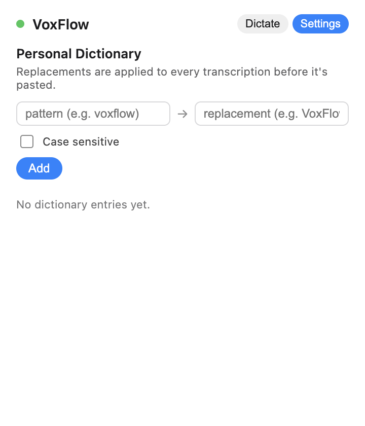
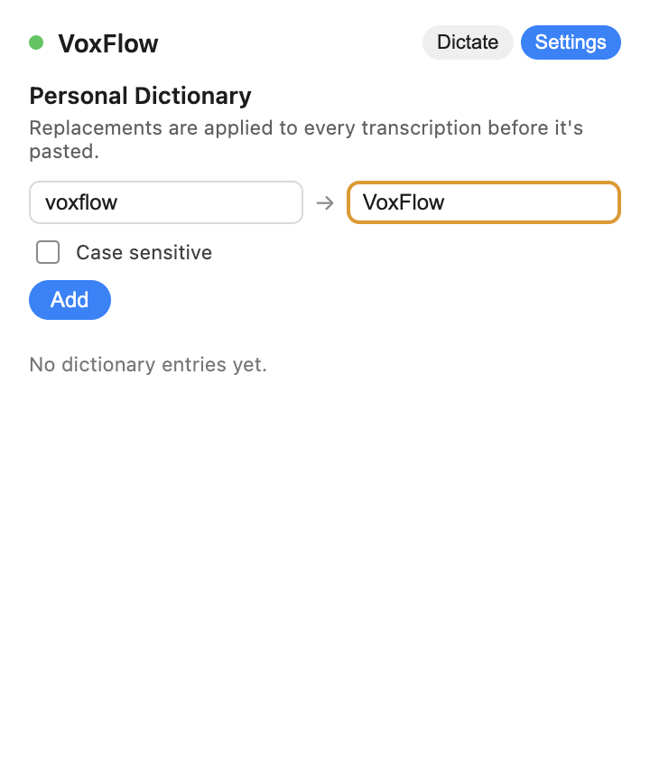
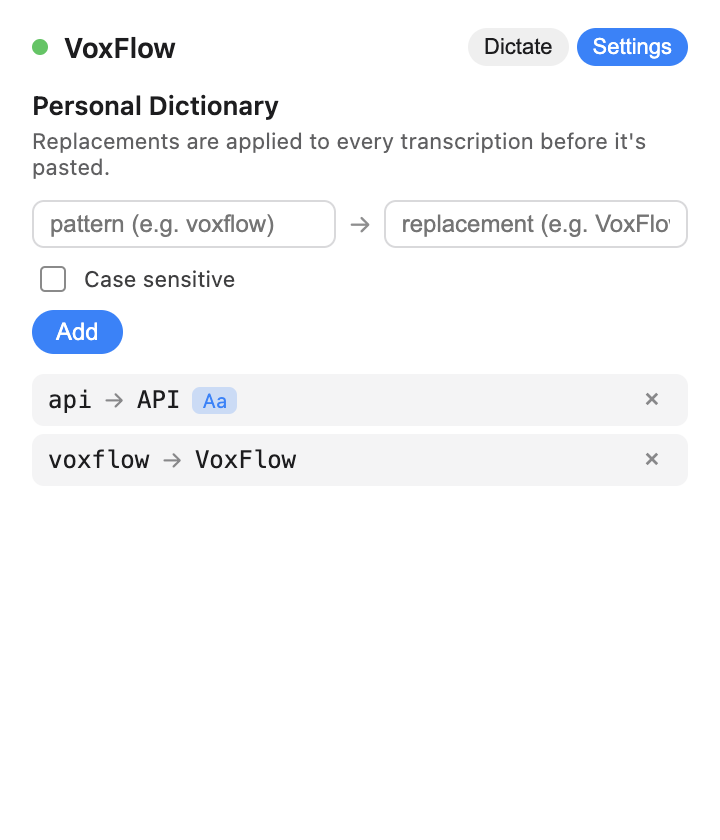
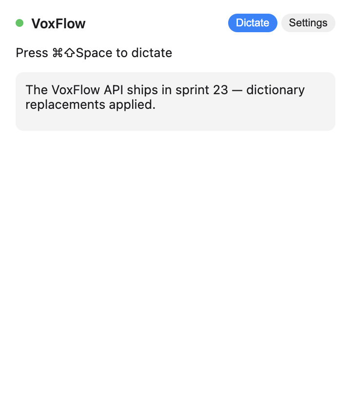

# M5 — Local Data Layer (SQLite)

Source: [#5 M5: Local Data Layer](https://github.com/gregdbanks/voxflow/issues/5)

## Storage

- `Database` runs a simple migration system (`schema_migrations` bookkeeping
  table + inlined `MIGRATIONS` array). The `001_initial.sql` source lives
  alongside the TS copy that actually ships in the bundle; a unit test asserts
  they stay in sync.
- `DictionaryRepository` — add / remove / list entries and `applyTo(text)` for
  pipeline post-processing. Case-insensitive by default, with a case-sensitive
  flag. Replacements are Unicode-word-boundary aware (`cat → dog` does NOT
  change `concatenate`).
- `CorrectionRepository` — records every injected transcription + active app
  for later analysis (prepares M6's context-aware cleanup).
- `SettingsRepository` — key/value table seeded with `cleanup_enabled`,
  `hotkey`, `language`. `get()` always returns a fully-populated `AppSettings`
  object; `update(patch)` is partial.

The SQLite file lives at `~/Library/Application Support/voxflow/voxflow.sqlite`
in the packaged app. All repository tests use `:memory:` so they're hermetic.

## Dictionary applied as post-processing

`DictationPipeline` now accepts an optional `dictionary: IDictionaryRepository`
and runs `dictionary.applyTo(text)` between the transcription response and the
`injecting` step. Empty transcriptions short-circuit; no paste, no dictionary
pass.

## Automated screenshots

### `01-settings-empty-dictionary.png`



First run. Settings tab, `Personal Dictionary` heading, the add form, and a
hint line. Empty-list message showing below.

### `02-settings-entry-typed.png`



`voxflow → VoxFlow` typed into the form, about to submit.

### `03-settings-two-entries.png`



After adding `voxflow → VoxFlow` and the case-sensitive `api → API` (note the
`Aa` flag). Each row has a ✕ remove button that fires `dictionary.remove(id)`.

### `04-dictate-after-dictionary.png`



Dictate tab, with a recent transcription showing the replaced text (`VoxFlow
API`). This is the same box M3 populated; the only difference is that the
dictionary ran first, pre-injection.

### `05-settings-entry-removable.png`


Settings tab in its "fully populated" state — this is the view you'd use to
clean up a bad replacement. Clicking ✕ removes the entry and re-renders the
list.

## Done-when coverage

| Criterion | Evidence |
|---|---|
| SQLite DB created on first launch | `Database` mkdirs the containing directory and runs migrations on first `migrate()`. Main process logs the applied migration names on startup. |
| Dictionary manageable via settings UI | `01-settings-empty-dictionary.png`, `03-settings-two-entries.png`, `05-settings-entry-removable.png` |
| Dictionary replacements applied to transcription | `DictationPipeline.test.ts > applies the personal dictionary to the transcription before injection` + `04-dictate-after-dictionary.png` |
| All repository tests pass with in-memory SQLite | `test/unit/services/storage/*.test.ts` — 15 tests across `Database`, `Dictionary`, `Correction`, `Settings`, `Migrations` |

## Native module note

`better-sqlite3` ships a prebuilt binary for Node, not Electron. After
`npm install`, rebuild it against the active Electron ABI:

```bash
npx @electron/rebuild -f -w better-sqlite3
```

Electron Forge's `AutoUnpackNativesPlugin` does this for packaged builds; the
manual step is only needed for dev / e2e runs that launch Electron against
`node_modules/`.
