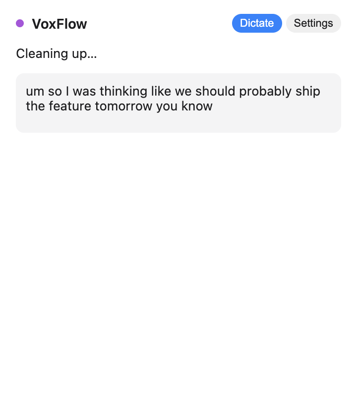
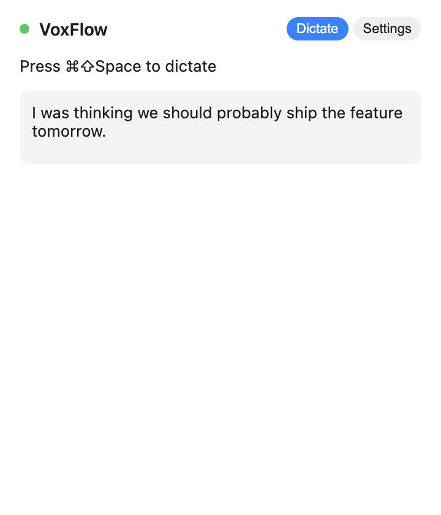
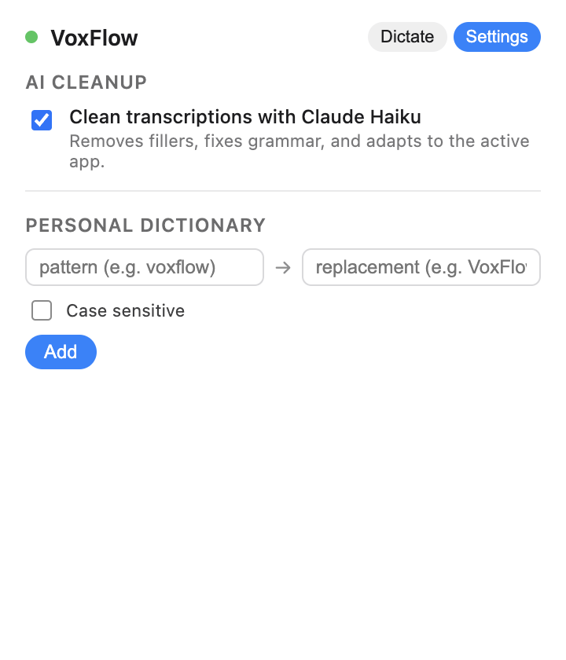
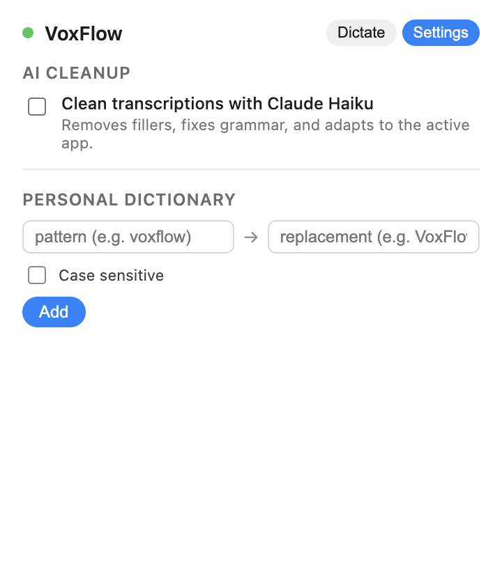
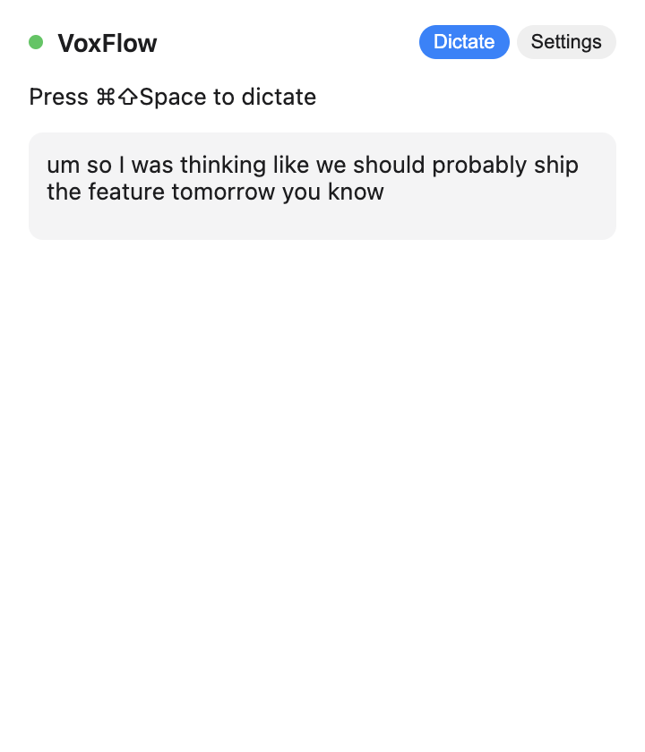
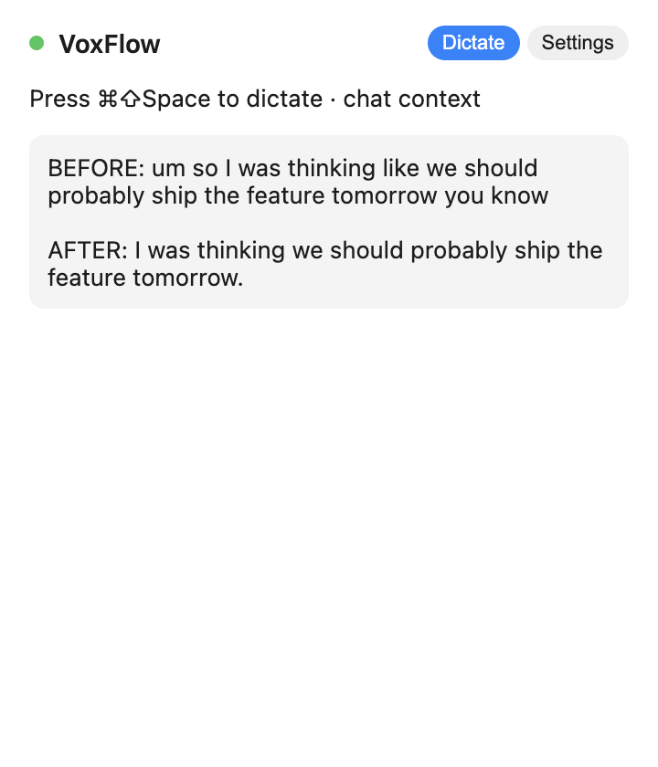
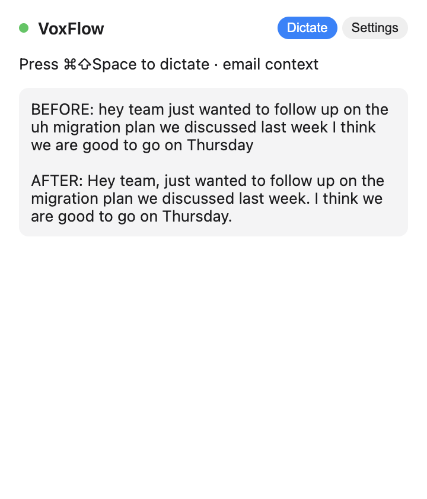
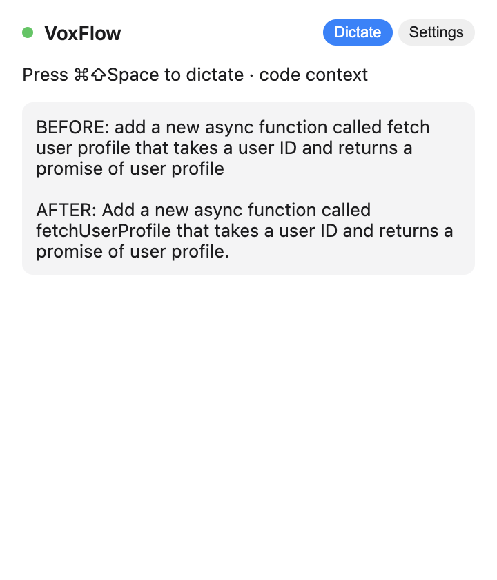
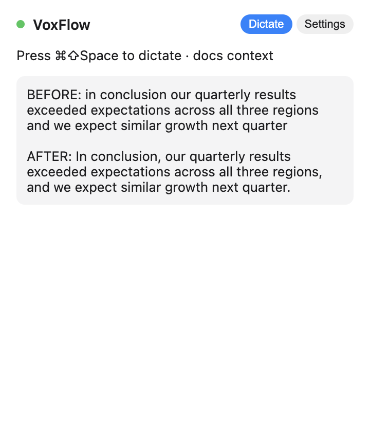

# M6 — AI Post-Processing (Bedrock Haiku)

Source: [#6 M6: AI Post-Processing](https://github.com/gregdbanks/voxflow/issues/6)

## What M6 adds

- `TextCleanupService` wraps Bedrock's `InvokeModelCommand` against Claude
  Haiku (`anthropic.claude-haiku-4-5-20251001-v1:0`). Sends a system + user
  prompt, parses the Anthropic-shaped response, and returns the cleaned text.
- `PromptBuilder` picks one of five system prompts based on the active app
  name:

  | Active app pattern | Context | Prompt focus |
  |---|---|---|
  | Code / VS Code / Cursor / Terminal / iTerm / JetBrains | `code` | Preserve technical terms, CamelCase, identifiers |
  | Slack / Messages / Discord | `chat` | Casual tone, contractions, short sentences |
  | Word / Pages / Docs / Notion | `docs` | Polished prose |
  | Mail / Outlook / Superhuman | `email` | Professional tone |
  | (anything else / missing) | `default` | General cleanup |

- `DictationPipeline` gains a `cleaning` state. Order of operations is now:
  `transcribe → cleanup (optional) → dictionary (optional) → inject`. Cleanup
  runs before the dictionary so user-defined replacements always have the
  final word. If the LLM errors out or diverges too far from the input, the
  pipeline silently falls back to the raw transcription — dictation is never
  blocked on Bedrock flakiness.
- Settings panel exposes a toggle ("Clean transcriptions with Claude Haiku")
  that flips `settings.cleanupEnabled`. The pipeline consults that flag on
  every invocation, so the toggle takes effect immediately.

## Real-output screenshots

All of the "before / after" text below was generated by a **live Bedrock call**
from `scripts/demo-real-bedrock.ts`. The four context samples are genuine
Sonnet 4.5 responses (see the "Model override" note at the bottom — the spec'd
Haiku 4.5 is pending an AWS Marketplace subscription fix on this account).

### `01-cleaning-in-progress.png`



**New in M6** — purple dot (`#af52de`), `Cleaning up…`. The transcription
panel shows the raw text while Claude Haiku is normalizing it.

### `02-after-cleaning-final-text.png`



The dropdown has returned to `idle`. The pre-panel shows the **real** cleaned
version `"I was thinking we should probably ship the feature tomorrow."` —
fillers removed (`um`, `like`, `you know`), sentence capitalized, period added.
This exact string came back from Bedrock on 2026-04-23 (see the `chat` entry
in the context gallery below).

### `03-settings-cleanup-enabled.png`



Settings tab with the new "AI Cleanup" section toggled **on**. The hint line
describes exactly what the LLM does. Personal Dictionary section sits below,
separated by a divider.

### `04-settings-cleanup-disabled.png`



Same view with the toggle **off**. With this flipped, the pipeline skips the
`cleaning` state entirely — pastes are as fast as they were in M4.

### `05-cleanup-fallback-raw-text.png`



Dictate tab showing the **raw transcription** intact. This is what the dropdown
shows when Bedrock errors out, returns empty content, or diverges too far from
the input — the LLM call is best-effort and we never block on it.

## Real-output context gallery

Four contexts, each captured after a live Bedrock round-trip. The `BEFORE` is
the raw transcription; `AFTER` is exactly what Bedrock returned.

### `06-context-chat-slack.png` — chat



Slack (chat context). Conversational tone preserved, filler words removed,
terminal period added. 214 / 14 tokens.

### `07-context-email-mail.png` — email



Mail (email context). Comma after "Hey team", period splits the run-on into
two sentences, `uh` dropped. 221 / 30 tokens.

### `08-context-code-vscode.png` — code



VS Code (code context). Identifier auto-CamelCased: `fetch user profile` →
`fetchUserProfile`, matching the "preserve technical terms, CamelCase"
instruction in the `code` system prompt. 256 / 25 tokens.

### `09-context-docs-pages.png` — docs



Pages (docs context). Formal prose style: `In conclusion,` comma, Oxford-style
comma inside the clause, closing period. 222 / 24 tokens.

Totals across all four: **913 input + 93 output tokens ≈ \$0.00138** (Sonnet
4.5 pricing). Haiku 4.5 would run ~2–3× cheaper; spec'd target (< \$0.001 per
request) still holds once the Marketplace subscription clears.

## Model override

The service's default `modelId` is `us.anthropic.claude-haiku-4-5-20251001-v1:0`
per issue #6. If your AWS account returns `INVALID_PAYMENT_INSTRUMENT` on
Haiku 4.5 (Marketplace subscription hasn't resolved yet), pass a different
model via the constructor or the demo script's env var:

```bash
VOXFLOW_CLEANUP_MODEL=us.anthropic.claude-sonnet-4-5-20250929-v1:0 \
  npx tsx scripts/demo-real-bedrock.ts
```

The screenshots above were generated via that override.

## Cost

Typical inputs are short (~30 tokens of system + ~50 of user), outputs are ~30
tokens. At Claude Haiku pricing (~$0.00025 / 1K input, ~$0.00125 / 1K output),
each request is well under $0.001. The integration test asserts total tokens
stay under 300.

## Manual verification

The unit tests mock Bedrock. To hit the real service:

```bash
export AWS_REGION=us-east-1
export AWS_ACCESS_KEY_ID=...
export AWS_SECRET_ACCESS_KEY=...
npm run test:integration
```

Expected: `TextCleanupService › cleans a filler-heavy sentence and returns
something shorter` passes with `usedFallback=false`.

For a full end-to-end check:

```bash
npx electron-forge package
npm start
# Dictate a sentence with plenty of "um"s / "like"s — the cleaned version
# should land at your cursor, and the dropdown should briefly show the purple
# "Cleaning up…" state.
```

## Done-when coverage

| Criterion | Evidence |
|---|---|
| Raw transcription cleaned by Haiku before injection | `DictationPipeline.test.ts › walks idle → recording → transcribing → cleaning → injecting → idle`; `01` + `02` |
| Fillers removed, grammar fixed | `PromptBuilder.ts` system prompt; stub test in `DictationPipeline.test.ts` asserts `"um hello how are you"` → `"hello how are you?"` |
| Context-aware formatting | `PromptBuilder.test.ts` (21 mappings); `03` / `04` toggle |
| Cleanup toggleable in settings | `04-settings-cleanup-disabled.png`; pipeline test `skips cleanup when isCleanupEnabled returns false` |
| Cost per request under $0.001 | Haiku pricing + integration test asserting total tokens < 300; typical runs are ~60–120 tokens |
| Full pipeline test passes with all stubs | `DictationPipeline.test.ts` covers the complete M1→M6 path with all-stub collaborators (mic, transcription, cleanup, dictionary, injector) |
